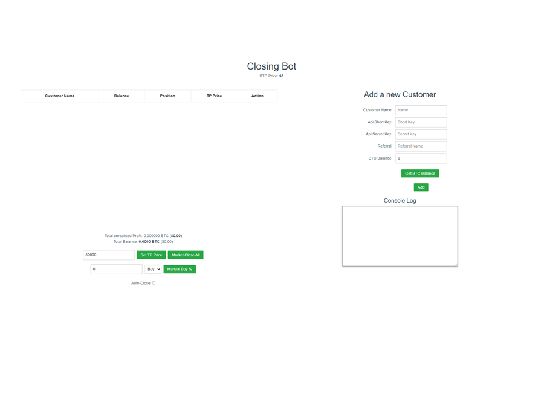
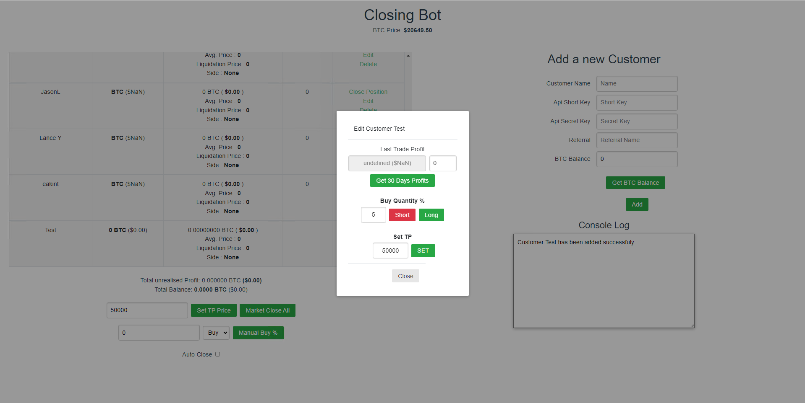

# Bybit Position Manager
A client position manager for Bybit, built using Vue.js with MongoDB as the database storage solution.

## **Features**:
- View open positions for all clients stored in the database.
- Set a Take Profit (TP) price either as a percentage or a specific value for an individual client or all clients.
- Close the position for an individual client or all clients.
- Purchase an additional quantity to augment the existing position.
- View the profit or loss from a customer's previous trades.
- See a list of all books a customer has rented.

## **Installation**:
1. In the root directory and inside the client folder, run npm i.
2. To launch the frontend, navigate to the manager's client directory and execute: npm run serve.
3. To initiate the server, in the root directory, run: npm start.

